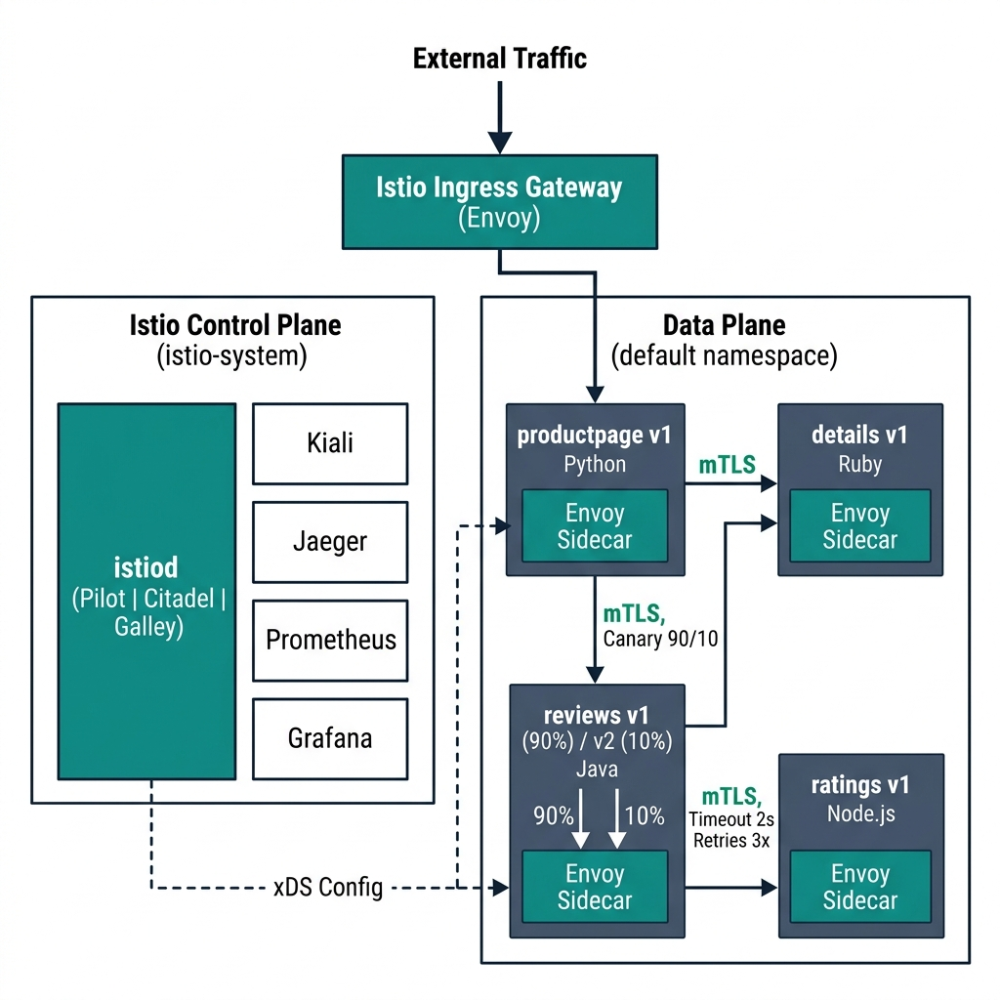

# Kubernetes Service Mesh & Traffic Management with Istio

[](https://istio.io/)
[](https://kubernetes.io/)
[](LICENSE)

> Deploy and configure an Istio service mesh to manage the Bookinfo microservices application with canary deployments, mutual TLS, circuit breaking, fault injection, and distributed tracing.



---

## Table of Contents

- [Architecture Overview](#architecture-overview)
- [Prerequisites](#prerequisites)
- [Phase 1: Installation & App Deployment](#phase-1-installation--app-deployment)
- [Phase 2: Traffic Management](#phase-2-traffic-management)
- [Phase 3: Security (mTLS)](#phase-3-security-mtls)
- [Phase 4: Resiliency](#phase-4-resiliency)
- [Phase 5: Observability](#phase-5-observability)
- [Verification Commands](#verification-commands)
- [Repository Structure](#repository-structure)
- [Troubleshooting](#troubleshooting)

---

## Architecture Overview

This project deploys a full Istio service mesh with the following components:

| Component | Role |
|---|---|
| **istiod** | Control plane — pushes xDS config to all Envoy proxies |
| **Envoy Sidecars** | Data plane — intercepts all pod traffic for routing, security, telemetry |
| **Istio Ingress Gateway** | Edge proxy — routes external traffic into the mesh |
| **Kiali** | Service graph visualization dashboard |
| **Jaeger** | Distributed tracing backend |
| **Prometheus** | Metrics collection |
| **Grafana** | Metrics dashboards |

### Bookinfo Application Services

```
                    ┌──────────────┐
   External ──────► │ Ingress GW   │
   Traffic          └──────┬───────┘
                           │
                    ┌──────▼───────┐
                    │ productpage  │
                    │    (v1)      │
                    └──┬───────┬───┘
                       │       │
              ┌────────▼──┐ ┌──▼────────┐
              │  details   │ │  reviews   │
              │   (v1)     │ │(v1/v2/v3) │
              └────────────┘ └──┬────────┘
                                │
                         ┌──────▼──────┐
                         │  ratings    │
                         │    (v1)     │
                         └─────────────┘
```

- **productpage** (Python) — Frontend UI, calls details and reviews
- **details** (Ruby) — Book information
- **reviews** (Java) — v1: no stars, v2: black stars, v3: red stars
- **ratings** (Node.js) — Star ratings data

---

## Prerequisites

| Tool | Version | Purpose |
|---|---|---|
| Kubernetes Cluster | 1.28+ | Minikube, Kind, Docker Desktop, or GKE/EKS |
| `kubectl` | Latest | Cluster management CLI |
| `istioctl` | 1.20.x | Istio installation & diagnostics |
| Docker | 20.10+ | Container runtime |

```bash
# Verify cluster connectivity
kubectl cluster-info

# Install istioctl (Linux/macOS)
curl -L https://istio.io/downloadIstio | ISTIO_VERSION=1.20.2 sh -
export PATH=$PWD/istio-1.20.2/bin:$PATH
istioctl version
```

---

## Phase 1: Installation & App Deployment

### Step 1: Install Istio Control Plane (demo profile)

```bash
# Pre-flight check
istioctl x precheck

# Install with demo profile (includes telemetry components)
istioctl install --set profile=demo -y

# Verify control plane is running
kubectl get pods -n istio-system
# Expected: istiod, istio-ingressgateway, istio-egressgateway all Running
```

### Step 2: Enable Automatic Sidecar Injection

```bash
# Label the default namespace for automatic Envoy injection
kubectl label namespace default istio-injection=enabled

# Verify the label
kubectl get namespace default --show-labels
```

### Step 3: Deploy the Bookinfo Application

```bash
# Deploy all microservices
kubectl apply -f app-manifests/bookinfo.yaml

# Wait for pods to be ready (2/2 containers = app + envoy sidecar)
kubectl get pods -w
# Expected output:
# NAME                              READY   STATUS    RESTARTS   AGE
# details-v1-xxxxx-xxxxx            2/2     Running   0          1m
# productpage-v1-xxxxx-xxxxx        2/2     Running   0          1m
# ratings-v1-xxxxx-xxxxx            2/2     Running   0          1m
# reviews-v1-xxxxx-xxxxx            2/2     Running   0          1m
# reviews-v2-xxxxx-xxxxx            2/2     Running   0          1m
# reviews-v3-xxxxx-xxxxx            2/2     Running   0          1m
```

### Verify Sidecar Injection

```bash
# Confirm istio-proxy container is present in a pod
kubectl describe pod -l app=productpage | grep -A2 "Containers:"

# Check Envoy proxy version
istioctl proxy-status

# Validate mesh configuration — must return "No validation issues found"
istioctl analyze
```

---

## Phase 2: Traffic Management

### Step 1: Configure Ingress Gateway

```bash
# Apply Gateway and VirtualService for external access
kubectl apply -f istio-configs/01-gateway.yaml

# Get the Ingress Gateway URL
export INGRESS_HOST=$(kubectl -n istio-system get service istio-ingressgateway \
  -o jsonpath='{.status.loadBalancer.ingress[0].ip}')
export INGRESS_PORT=$(kubectl -n istio-system get service istio-ingressgateway \
  -o jsonpath='{.spec.ports[?(@.name=="http2")].port}')
export GATEWAY_URL=$INGRESS_HOST:$INGRESS_PORT

# For Minikube users:
# export INGRESS_HOST=$(minikube ip)
# export INGRESS_PORT=$(kubectl -n istio-system get service istio-ingressgateway \
#   -o jsonpath='{.spec.ports[?(@.name=="http2")].nodePort}')

# Test access
curl -s http://$GATEWAY_URL/productpage | grep -o "<title>.*</title>"
# Expected: <title>Simple Bookstore App</title>
```

### Step 2: Canary Deployment (90/10 Traffic Split)

```bash
# Apply DestinationRules (version subsets) and canary VirtualService
kubectl apply -f istio-configs/02-routing.yaml

# Verify the routing rules
kubectl get virtualservice reviews -o yaml
kubectl get destinationrule reviews-destination -o yaml
```

**Verify the 90/10 split** — Run 100 requests and count responses:

```bash
# Generate traffic and classify responses by review version
v1=0; v2=0
for i in $(seq 1 100); do
  RESPONSE=$(curl -s http://$GATEWAY_URL/productpage)
  if echo "$RESPONSE" | grep -q 'color="black"'; then
    v2=$((v2 + 1))       # v2 = black star ratings
  else
    v1=$((v1 + 1))       # v1 = no star ratings
  fi
done
echo "v1 (stable): $v1 | v2 (canary): $v2"
# Expected: ~90 v1, ~10 v2 (statistical variance is normal)

# Alternative: verify weights directly from the VirtualService spec
kubectl get virtualservice reviews -o jsonpath='{.spec.http[0].route[*].weight}'
# Expected output: 90 10
```

---

## Phase 3: Security (mTLS)

### Enforce Strict Mutual TLS

```bash
# Apply strict mTLS policy
kubectl apply -f istio-configs/03-security.yaml

# Verify the policy
kubectl get peerauthentication -n default
```

### Verify mTLS Enforcement

```bash
# Method 1: Check mTLS status via istioctl
istioctl x describe pod $(kubectl get pod -l app=productpage -o jsonpath='{.items[0].metadata.name}')

# Method 2: Attempt plaintext connection from outside the mesh
kubectl create namespace non-mesh
kubectl run curl-test --image=curlimages/curl -n non-mesh \
  --restart=Never --rm -it -- \
  curl -s -o /dev/null -w "%{http_code}" http://productpage.default:9080/productpage
# Expected: Connection reset / error (plaintext rejected by strict mTLS)

# Method 3: Verify TLS certificates in Kiali
# Look for padlock icons on all service edges in the graph

# Cleanup test namespace
kubectl delete namespace non-mesh
```

---

## Phase 4: Resiliency

### Apply Timeouts, Retries, Circuit Breaker & Fault Injection

```bash
# Apply all resiliency configurations
kubectl apply -f istio-configs/04-resiliency.yaml

# Verify configurations
kubectl get virtualservice ratings -o yaml    # Timeouts, retries & fault injection
kubectl get destinationrule ratings-destination -o yaml  # Circuit breaker + subsets

# Validate no conflicts (must show "No validation issues found")
istioctl analyze
```

### What Each Config Does

All resiliency features are applied to the `ratings` service so that fault injection
directly validates the timeout and retry chain on the same call path:

| Feature | Target | Configuration | Purpose |
|---|---|---|---|
| **Timeout** | ratings | 2s max per request | Prevent hanging requests |
| **Retries** | ratings | 3 attempts on 5xx/connect-failure/reset | Auto-recover from transient errors |
| **Circuit Breaker** | ratings | Eject after 5 consecutive gateway errors for 30s | Isolate degraded endpoints |
| **Fault Delay** | ratings | 5s delay for 50% of requests | Validates timeout catches the delay |
| **Fault Abort** | ratings | HTTP 500 for 10% of requests | Validates retry logic triggers |

### Test Fault Injection

```bash
# Send requests and observe how timeouts catch the 5s injected delay
for i in $(seq 1 20); do
  START=$(date +%s%N)
  CODE=$(curl -s -o /dev/null -w "%{http_code}" http://$GATEWAY_URL/productpage)
  END=$(date +%s%N)
  ELAPSED=$(( (END - START) / 1000000 ))
  echo "Request $i: HTTP $CODE (${ELAPSED}ms)"
done
# Expected behavior:
#   ~50% of requests to ratings timeout at 2s (injected delay is 5s > 2s timeout)
#   ~10% return errors from HTTP 500 abort injection
#   Retries (up to 3) are attempted automatically on failures
```

---

## Phase 5: Observability

### Step 1: Deploy Telemetry Add-ons

```bash
# Install Prometheus, Kiali, Jaeger, and Grafana
kubectl apply -f https://raw.githubusercontent.com/istio/istio/release-1.20/samples/addons/prometheus.yaml
kubectl apply -f https://raw.githubusercontent.com/istio/istio/release-1.20/samples/addons/kiali.yaml
kubectl apply -f https://raw.githubusercontent.com/istio/istio/release-1.20/samples/addons/jaeger.yaml
kubectl apply -f https://raw.githubusercontent.com/istio/istio/release-1.20/samples/addons/grafana.yaml

# Wait for deployments to be ready
kubectl rollout status deployment/kiali -n istio-system
kubectl rollout status deployment/jaeger -n istio-system
kubectl rollout status deployment/prometheus -n istio-system
kubectl rollout status deployment/grafana -n istio-system
```

### Step 2: Generate Traffic for Telemetry

```bash
# Generate sustained traffic (run in background)
while true; do
  curl -s -o /dev/null http://$GATEWAY_URL/productpage
  sleep 0.5
done
```

### Step 3: Access Dashboards

```bash
# Kiali — Service graph with traffic flows and mTLS indicators
istioctl dashboard kiali
# Navigate to: Graph → Select "default" namespace → Observe traffic flows

# Jaeger — Distributed traces across service hops
istioctl dashboard jaeger
# Search for: Service = "istio-ingressgateway" → Find Traces

# Grafana — Istio metrics dashboards
istioctl dashboard grafana
# Navigate to: Dashboards → Istio → Istio Service Dashboard

# Prometheus — Raw metrics
istioctl dashboard prometheus
```

### What to Look For

| Dashboard | Evidence |
|---|---|
| **Kiali** | Service graph showing productpage → details/reviews → ratings, padlock icons (mTLS), traffic rates |
| **Jaeger** | Traces spanning productpage → details → reviews → ratings with timing data |
| **Grafana** | Request rate, error rate, latency (RED metrics) per service |

---

## Verification Commands

Quick reference for all verification steps:

```bash
# ── Control Plane ──
kubectl get pods -n istio-system                         # istiod running
istioctl version                                         # Version check

# ── Sidecar Injection ──
kubectl get pods -n default                              # All pods 2/2
kubectl get namespace default --show-labels              # istio-injection=enabled

# ── Gateway & Routing ──
kubectl get gateway                                      # bookinfo-gateway exists
kubectl get virtualservice                               # bookinfo, reviews, ratings

# ── Canary Split ──
kubectl get virtualservice reviews -o jsonpath='{.spec.http[0].route[*].weight}'
# Expected: 90 10

# ── mTLS ──
kubectl get peerauthentication -n default                # mode: STRICT
istioctl x describe pod $(kubectl get pod -l app=productpage \
  -o jsonpath='{.items[0].metadata.name}')               # Shows STRICT mTLS

# ── Circuit Breaker ──
kubectl get destinationrule ratings-destination -o yaml | grep -A8 outlierDetection

# ── Fault Injection ──
kubectl get virtualservice ratings -o yaml | grep -A6 fault

# ── Observability ──
kubectl get pods -n istio-system | grep -E "kiali|jaeger|prometheus|grafana"

# ── Full Mesh Validation ──
istioctl proxy-status                                    # All proxies SYNCED
istioctl analyze                                         # Must show: No validation issues
kubectl apply --dry-run=client -f istio-configs/          # Syntax validation
```

---

## Repository Structure

```
kubernetes-istio-service-mesh/
├── app-manifests/
│   └── bookinfo.yaml           # Kubernetes Deployments & Services (with health probes)
├── istio-configs/
│   ├── 01-gateway.yaml         # Istio Gateway + VirtualService for ingress
│   ├── 02-routing.yaml         # Canary VirtualService (90/10) + reviews DestinationRule
│   ├── 03-security.yaml        # PeerAuthentication (strict mTLS)
│   └── 04-resiliency.yaml      # Timeouts, retries, circuit breaker, fault injection
├── evidence/                   # Screenshots of Kiali, Jaeger, traffic split proof
├── architecture.png            # System architecture diagram
├── .gitignore                  # Git ignore rules
├── .editorconfig               # Editor formatting configuration
├── LICENSE                     # MIT License
└── README.md                   # This file — deployment & verification guide
```

---

## Troubleshooting

| Problem | Solution |
|---|---|
| Pods show `1/1` instead of `2/2` | Label namespace first: `kubectl label namespace default istio-injection=enabled`, then delete pods to recreate with sidecar |
| `404` from Ingress Gateway | Ensure VirtualService has `gateways: [bookinfo-gateway]` binding |
| Services fail after strict mTLS | Both caller and receiver pods must have Envoy sidecars injected |
| Traces are disconnected in Jaeger | Application must forward `x-request-id`, `x-b3-traceid`, `x-b3-spanid` headers |
| Circuit breaker not triggering | Verify `outlierDetection` in DestinationRule and generate enough 5xx errors |
| Kiali shows no traffic | Generate traffic: `curl http://$GATEWAY_URL/productpage` in a loop |

---

## Cleanup & Teardown

To completely remove the Istio service mesh and application from the cluster:

```bash
# Step 1: Remove Istio configurations
kubectl delete -f istio-configs/

# Step 2: Remove the application
kubectl delete -f app-manifests/

# Step 3: Remove telemetry add-ons
kubectl delete -f https://raw.githubusercontent.com/istio/istio/release-1.20/samples/addons/prometheus.yaml
kubectl delete -f https://raw.githubusercontent.com/istio/istio/release-1.20/samples/addons/kiali.yaml
kubectl delete -f https://raw.githubusercontent.com/istio/istio/release-1.20/samples/addons/jaeger.yaml
kubectl delete -f https://raw.githubusercontent.com/istio/istio/release-1.20/samples/addons/grafana.yaml

# Step 4: Uninstall Istio control plane
istioctl uninstall --purge -y
kubectl delete namespace istio-system

# Step 5: Remove the sidecar injection label
kubectl label namespace default istio-injection-
```

---

## Technologies Used

| Tool | Purpose |
|---|---|
| **Kubernetes** | Container orchestration platform |
| **Istio 1.20** | Service mesh control & data plane |
| **Envoy Proxy** | L7 sidecar proxy (injected by Istio) |
| **Kiali** | Mesh topology visualization |
| **Jaeger** | Distributed tracing |
| **Prometheus** | Metrics collection |
| **Grafana** | Metrics dashboards |
| **Docker** | Container runtime |

---

## License

This project is licensed under the MIT License. See [LICENSE](LICENSE) for details.